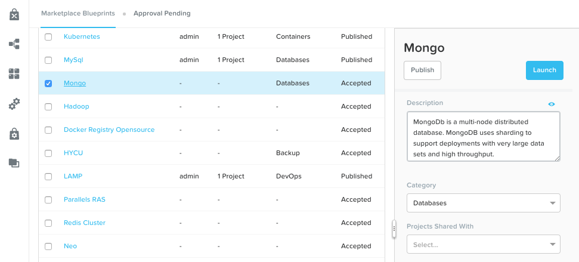
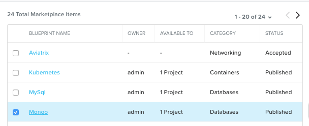
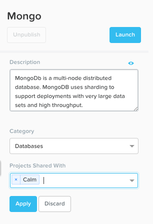
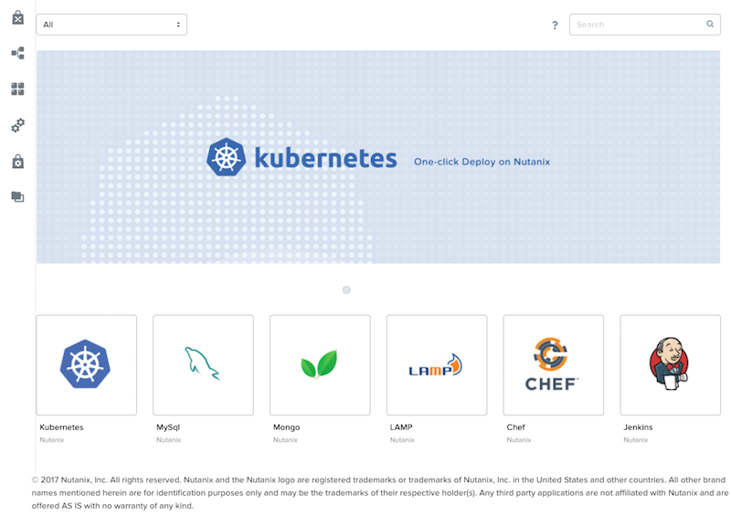
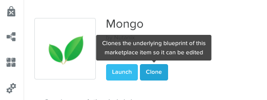
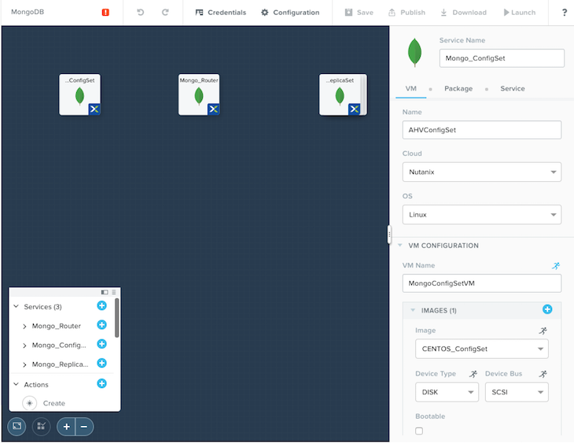
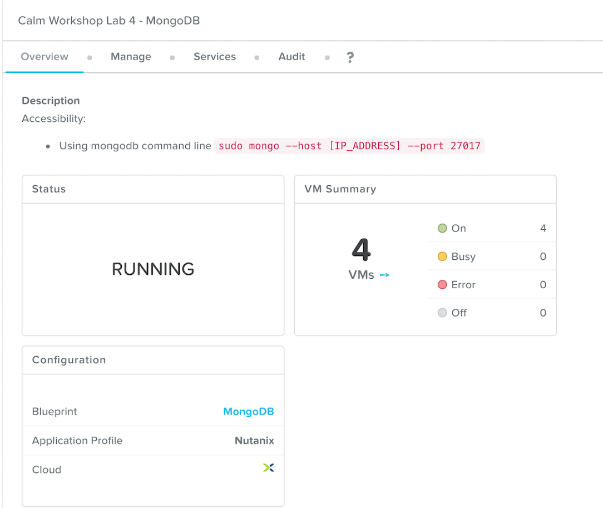

**************************
Calm Marketplace Part 1
**************************

Overview
************

.. note:: Estimated time to complete: **50 MINUTES**

In this exercise you will learn how to manage Calm Blueprints within the Nutanix Marketplace. As part of the exercise you will publish a pre-configured Blueprint to the local Marketplace, clone the Blueprint from the Marketplace for editing, and launch the application.

Publishing Blueprints from Marketplace Manager
**********************************************

By default, Calm comes pre-seeded with validated Blueprints for multiple open source and enterprise applications. Marketplace Manager acts as a staging area for publishing default and user-created Blueprints to your local Marketplace. The Marketplace acts as an application store, providing end users with a catalog of available applications.

From **Prism Central > Apps**, select |mktmgr-icon| **Marketplace Manager** from the sidebar.

Under **Marketplace Blueprints**, select **Mongo**.

Note the Blueprint description contains key information including licensing, hardware requirements, OS, supported platforms, and limitations. Click **Publish**.

Wait for the Blueprint **Status** to appear as **Published**.

Under **Projects Shared With**, select the **Calm** Project and click **Apply**.

.. note::

  If the **Projects Shared With** drop down menu is unavailable, refresh your browser.

Cloning Blueprints from Marketplace
***********************************

From **Prism Central > Apps**, select |mkt-icon| **Marketplace** from the sidebar. All Blueprints published in Marketplace Manager are visible here.

Select the **Mongo** Blueprint and click **Clone**.

.. note::

  Selecting **Actions Included** for a Blueprint will display the actions that have been implemented for a given Blueprint, such as Create, Start, Stop, Delete, Update, Scale Up, Scale Down, etc.

Fill out the following fields and click **Clone**:

- **Blueprint Name** - MongoDB*<INITIALS>*
- **Project** - Calm

Editing Cloned Blueprint
************************

Select |bp-icon| **Blueprints** from the sidebar and click your **MongoDB<INITIALS>** Blueprint to open the Blueprint Editor.

Click :fa:`exclamation-circle` to review the list of errors that would prevent a successful deployment of the Blueprint.

.. figure:: images/marketplace_p1_7.png

Click **Credentials** and select **CENTOS (Default)**.

Fill out the following fields and click **Back**:

- **Username** - root
- **Secret** - Password
- **Password** - nutanix/4u

Select the **Mongo_ConfigSet** Service and make the following changes in the **Configuration Pane**:

- Update the **VM Configuration > Image** to **CentOS**.
- Update the **Network Adapters > NIC** to **Secondary**.
- Update the **Connection > Credential** to **CENTOS**.

Repeat these steps for the **Mongo_Router** and **Mongo_ReplicaSet** Services.

Click **Save**.

Click **Launch**. Specify a unique **Application Name** (e.g. MongoDB*<INITIALS>*-1) and click **Create**.

Takeaways
***********
- By using pre-seeded Blueprints from the Nutanix Marketplace, users can quickly try out new applications.
- Marketplace Blueprints can be cloned and modified to suit a user's needs. For example, the pre-seeded LAMP Blueprint could be a starting point for a developer looking to swap PHP for a Go application server.
- Marketplace Blueprints can use local disk images or automatically download associated disk images. Users can create their own keys and slipstream them into Blueprints (via cloud-init) to control access.

.. |mktmgr-icon| image:: ../images/marketplacemanager_icon.png
.. |mkt-icon| image:: ../images/marketplace_icon.png

