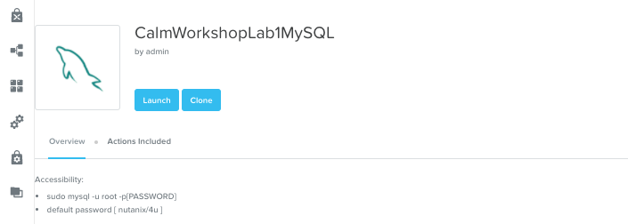
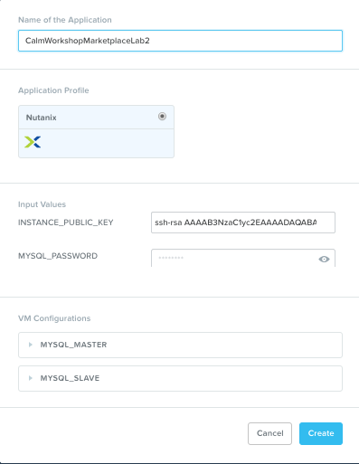

**************************
Calm Marketplace Part 2
**************************

Overview
************

.. note::

  This exercise assumes you have a Blueprint available from a previous exercise.

  Estimated time to completion: **40 MINUTES**

In this exercise you will learn how to manage Calm Blueprints within the Nutanix Marketplace. As part of the exercise you will publish a Blueprint from the Blueprint Editor, use Marketplace Manager to approve, assign roles and projects, and publish to the Marketplace. Finally you will edit a project environment so your Blueprint can be launched directly from the Marketplace.

Publishing Blueprints
*********************

From **Prism Central > Apps**, select |bp-icon| **Blueprints** from the sidebar.

Open any **Active** Blueprint by clicking on its **Name**.

.. figure:: images/marketplace_p2_1.png

Click **Publish**.

Provide a **Name** (e.g. Blueprint Name *<INITIALS>*) and **Description**, and click **Publish**.

.. figure:: images/marketplace_p2_3.png

Approving Blueprints
********************

From **Prism Central > Apps**, select |mktmgr-icon| **Marketplace Manager** from the sidebar.

.. note:: You must be logged in as a Cluster Admin user to access the Marketplace Manager.

Note your Blueprint does not appear in the list of **Marketplace Items**.

Select the **Approval Pending** tab.

.. figure:: images/marketplace_p2_4.png

Select your **Pending** Blueprint.

Review the available actions:

- **Reject** - Prevents  Blueprint from being launched or published in the Marketplace. The Blueprint will need to be submitted again after being rejected before it can be published.
- **Approve** - Approves the Blueprint for publication to the Marketplace.
- **Launch** - Launches the Blueprint as an application, similar to launching from the Blueprint Editor.

Click **Approve**.

Once the application has been successfully approved, assign the appropriate **Category** and **Project Shared With**. Click **Apply**.

Select the **Marketplace Blueprints** tab and select your Blueprint. Click **Publish**.

Verify the Blueprint's **Status** is now shown as **Published**.

From **Prism Central > Apps**, select |mkt-icon| **Marketplace** from the sidebar. Verify your Blueprint is available for launching as an application.

.. figure:: images/marketplace_p2_8.png

Configuring Project Environment
*******************************

To launch a Blueprint directly from the Marketplace, we need to ensure our Project has all of the requisite environment details to satisfy the Blueprint.

From **Prism Central > Apps**, select |proj-icon| **Projects** from the sidebar.

Select the Project **Name** associated with your Blueprint at the time of publishing (e.g. the **Calm** Project that was assigned as **Project Shared With**).

.. figure:: images/marketplace_p2_9.png

Select the **Environment** tab.

Under **Network Adapters (NICs)**, click :fa:`plus-circle` and select **Secondary**.

Under **Connection > Credential**, select **Add New Credential**. Fill out the following fields and click **Done**:

- **Credential Name** - CENTOS
- **Username** - root
- **Secret** - Password
- **Password** - nutanix/4u
- Select **Use as default**

Click **Save**.

Launching Blueprint from the Marketplace
****************************************

From **Prism Central > Apps**, select |mkt-icon| **Marketplace** from the sidebar.

.. figure:: images/marketplace_p2_11.png

Select the Blueprint published as part of this exercise and click **Launch**.

Select the **Calm** Project and click **Launch**.

.. figure:: images/marketplace_p2_13.png

Specify a unique **Application Name** (e.g. Marketplace*<INITIALS>*) and click **Create**.

.. note::

  To see the configured **Environment** details, expand the **VM Configurations** entities.

Monitor the provisioning of the Blueprint until complete.

.. figure:: images/marketplace_p2_15.png

Takeaways
*********
- Developers can publish Blueprints to the Marketplace for fast and easy consumption by users.
- Blueprints can be launched directly from the Marketplace with no additional configuration from users, delivering a public cloud-like SaaS experience for end users.
- Administrators have control over what Blueprints are published to the Marketplace and which projects have access to published Blueprints.

.. |bp-icon| image:: ../images/blueprints_icon.png
.. |mktmgr-icon| image:: ../images/marketplacemanager_icon.png
.. |mkt-icon| image:: ../images/marketplace_icon.png
.. |proj-icon| image:: ../images/projects_icon.png
